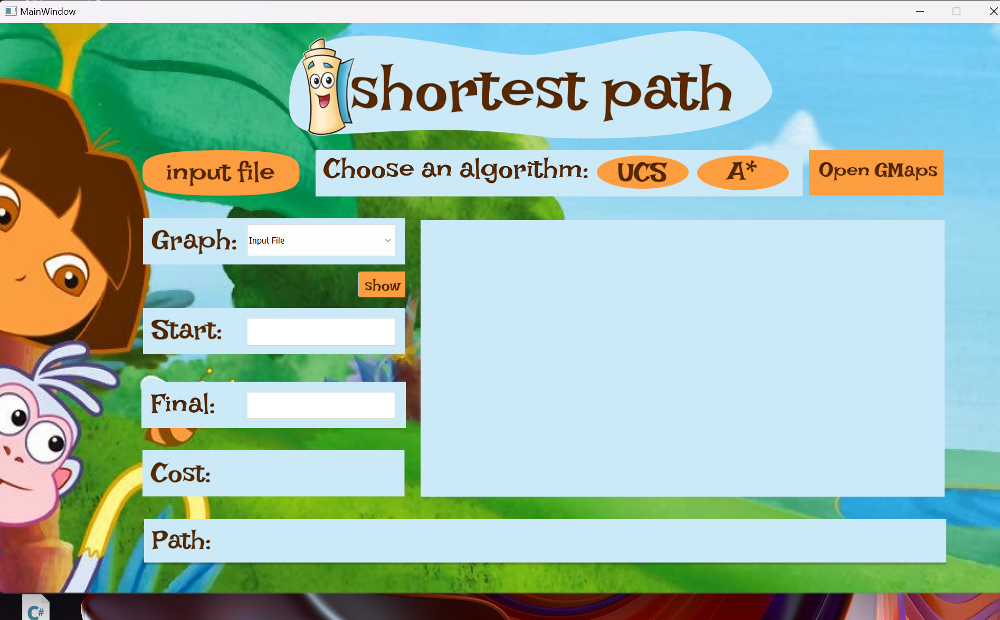
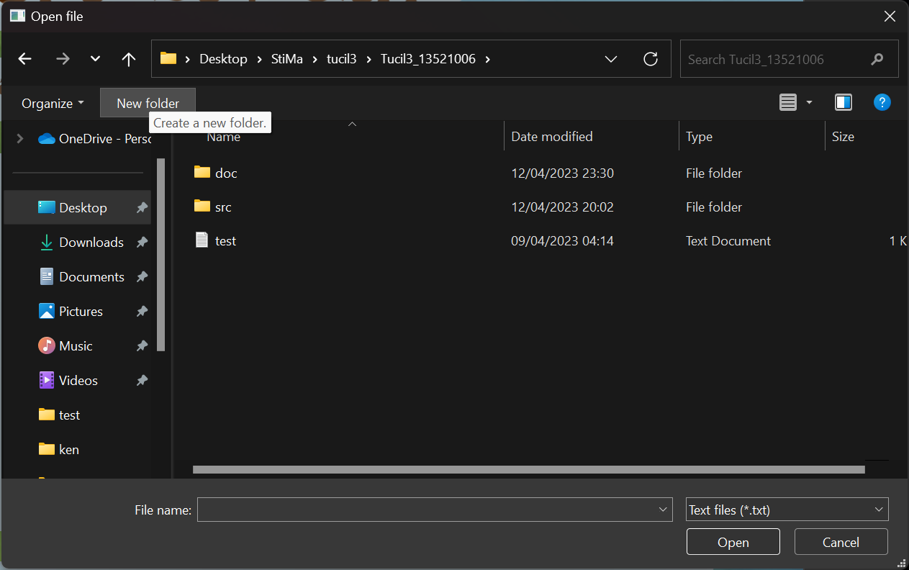
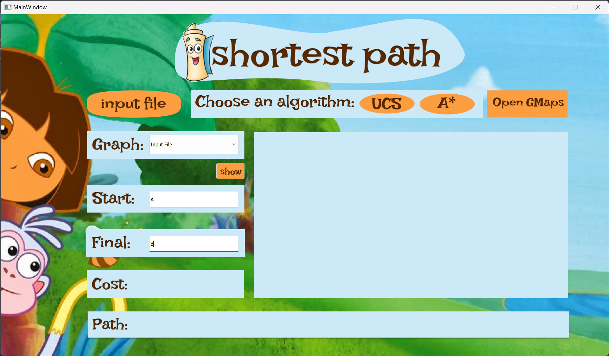
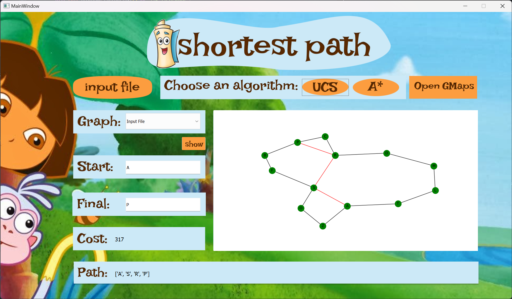
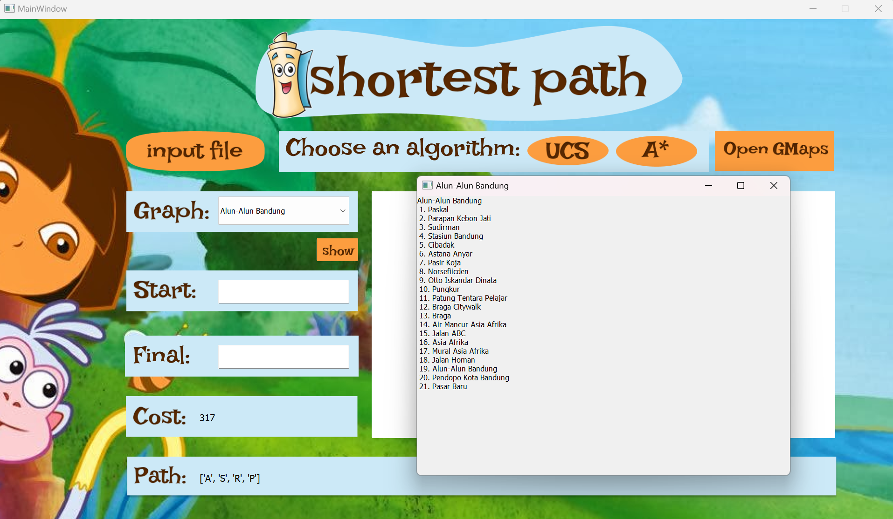
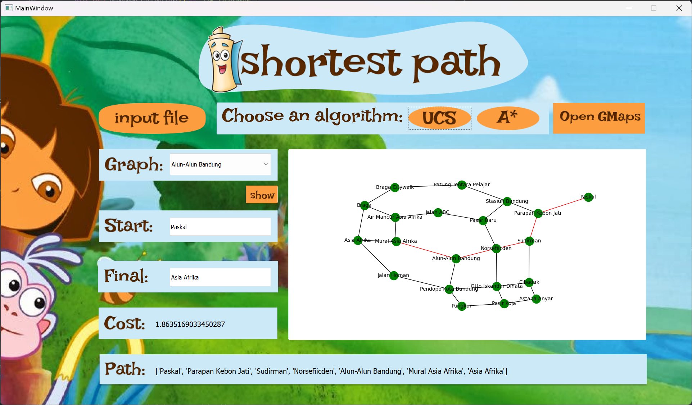
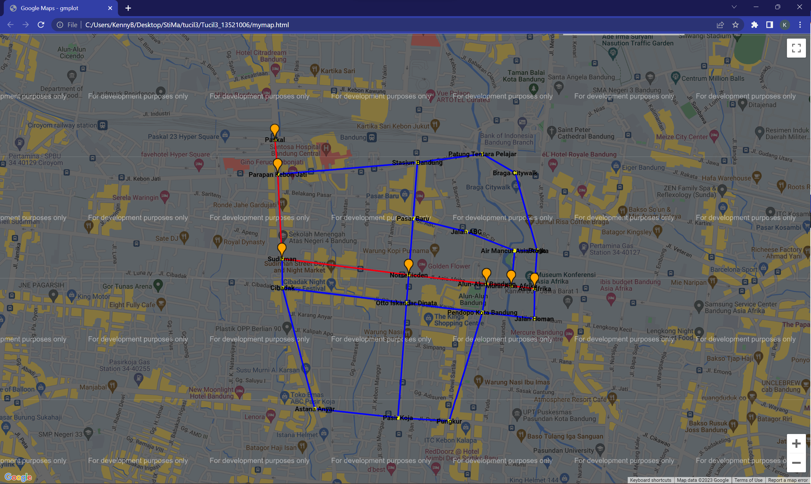

# Tucil3_13521006_13521023
>Tugas Kecil 3 IF2211 Strategi Algoritma

Implementasi Algoritma UCS dan A* untuk Menentukan Lintasan Terpendek

## Table of Contents
1. [Author](#author)
2. [Data Structure](#data-structure)
3. [General Informations](#general-informations)
4. [Technologies Used](#technologies-used)
5. [How to Run](#how-to-run)
6. [Project Status](#project-status)
7. [Acknowledgements](#acknowledgements)

## Author
| NIM | Nama |
|:---:|:----:|
|13521006| Azmi Hasna Zahrani|
|13521023| Kenny Benaya Nathan|

## Data Structure
```
├───doc                                 # Documentation
|    ├───Tucil3_13521006_13521023.pdf
|    ├───Tucil3-Stima-2023.pdf
|
├───src                                 # Source Code
|    ├───core                           # Core Program
|    |    ├───Area.py
|    |    ├───Components.py
|    |    ├───algorithm.py
|    |    ├───funtion.py
|    |    └───parsing.py
|    |
|    ├───gui                            # GUI Program
|    |    ├───images/
|    |    ├───gui.py
|    |    ├───gui.qrc
|    |    └───gui.ui
|    |
|    └───places                         # Places Data
|         ├───alunalun.py
|         ├───itbBdg.py
|         ├───itbNangor.py
|         ├───cilacap.py
|         └───buahBatu.py
│
├───main.py                             # Main Program
├───mymap.html                          # Map Output
├───test.txt                            # Matrix Data
└───README.md
```

## General Informations
Program ini merupakan program pencari lintasan terpendek dalam graph dan peta dengan mengimplementasikan algoritma Uniform-Cost Search dan algoritma A*. Program ini ditulis dalam bahasa Python serta menggunakan GUI sederhana sebagai interfacenya. Pencarian lintasan terpendek dapat menggunakan input file berupa (.txt) serta peta yang telah disediakan pada program. Program ini juga menggunakan Google Map API untuk menampilkan peta.

## Technologies Used
- Python 3.11.2
- Package sys
- Package webbrowser
- Package gmplot
- Package os
- Package matplotlib
- PyQt5 5.15.9
- Figma

## How to Run
<div>
1. Clone repository ini dengan menjalankan perintah berikut pada terminal:

```bash
git clone https://github.com/goodgirlwannabe/Tucil3_13521006_13521023.git
```
</div>
<div>
2. Install semua <i>requirements</i> yang dibutuhkan
</div>
<div>
3. Jalankan program utama pada directory repository ini dengan menjalankan perintah berikut pada terminal:

```bash
py main.py
```
</div>



<br>
4. Di dalam GUI, upload file yang berisi data matrix dengan cara menekan tombol input file. Perhatikan bahwa format file yang dapat diupload adalah file .txt. Contoh dari file ini dapat dilihat pada file 'test.txt'. Contoh lain format sebagai berikut:

```txt
0 25 14             < Weighted Adjecency Matrix >
25 0 10             < Setiap Kolom dipisah dengan spasi >
14 10 0             < Setiap baris dipisah dengan newline >

A B C               < Nama setiap node yang dipisah dengan spasi >

< abaikan pesan dalam blok <> >
```



<br>
5. Masukkan nama node awal pada input 'Start' dan 'Final'



<br>
6. Pilih algoritma yang akan digunakan untuk mencari lintasan terpendek. Hasil akan langsung tersedia berupa graf visualisasi, jarak yang ditempuh dan jalur yang ditempuh



<br>
7. Anda juga bisa memilih peta yang telah disediakan pada program jika mengklik tombol pada dropdown di samping 'Graph'. Peta yang tersedia adalah peta ITB Bandung, Peta Alun-Alun Bandung, Peta ITB Nangor, Peta Cilacap, dan Peta Buah Batu.


<br>
8. Anda bisa melihat titik-titik mana yang bisa anda pilih untuk menjadi node awal dan node akhir dengan mengklik tombol 'Show Map'



<br>
9. Ulangi langkah 5-6 untuk mencari lintasan terpendek pada peta yang telah dipilih



<br>
10. Program akan menuliskan file 'mymap.html' pada root directory. Klik tomboll 'OpenGMaps' untuk melihat visualisasi file tersebut dalam bentuk google maps interaktif.



## Project Status
Project Status: Completed


## Acknowledgements
- Program ini dibuat untuk memenuhi Tugas Kecil 3 IF2211 Strategi Algoritma
- Terima kasih kepada Dosen serta Asisten yang telah mengampu Mata Kuliah IF2211 Strategi Algoritma
